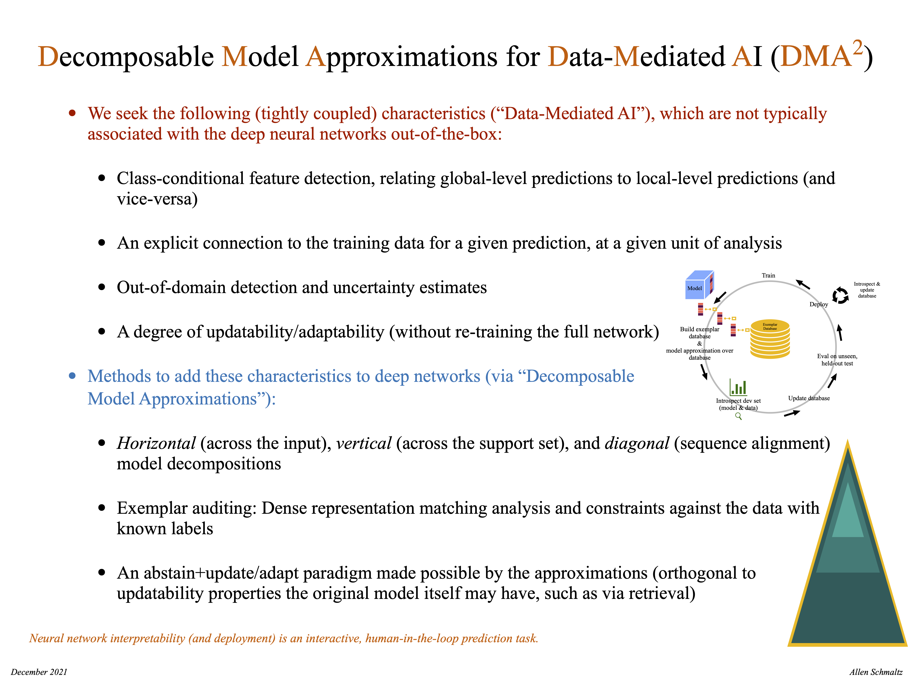

# Resolute Resolutions (a blog by Allen Schmaltz)

Fine-grained commentary for a coarse-grained world

## Volumes:

1. [NLP/AI Conference "Peer" Review: A Tragedy of the (Knowledge) Commons?](volume1/volume1.pdf) July 18, 2020
2. [Part 1 of N: An Informal \[in\]Formality: AI?](volume2/volume2.pdf) January 9, 2021
3. [Practical, Real-World Neural Network Interpretability and Deployment: Decomposable Model Approximations for Data-Mediated AI (DMA^2)](volume3/volume3.pdf) December 11, 2021
    * [Volume 3 summary](volume3/summary/data_mediated_ai.pdf)
    * 
      *See Volume 3 for additional details.*
4. [AI:=Introspection+Updatability+Uncertainty](volume4/volume4.pdf) July 11, 2022
5. [The Determinants of Controllable AGI](volume5/volume5.pdf) March 23, 2025
